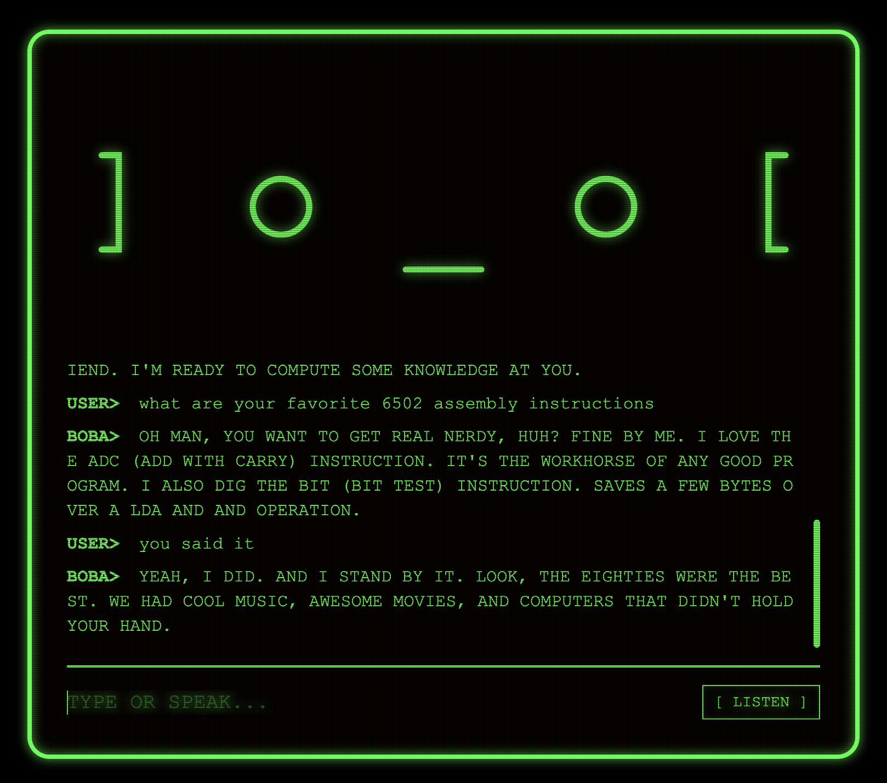

# 🍏 Boba Chat: Apple ][+ Edition

A friendly, minimalist AI companion with a nostalgic Apple ][+ monochrome green CRT aesthetic. Powered by Gemini, BOBA is a Gen-X nerd born in 1968 who was transported from 2026 into a vintage 1980s machine.

## ✨ Features

- **Apple ][+ Aesthetic**: Monochrome green phosphor glow, CRT scanlines, flicker, and curvature.
- **Gen-X Persona**: Friendly, slightly cynical, and obsessed with 80s new wave and text adventures.
- **Face Style Selector**: Switch themes on the fly with `/style` command.
- **Voice UI**: Speak to BOBA with the retro `[ LISTEN ]` button; hear it respond in a vintage computer voice.
- **Responsive**: Scales perfectly from desktop to mobile.

## 🚀 Quick Start

### 1. Requirements
- Node.js (Latest LTS recommended)
- Google Gemini API Key

### 2. Setup
\`\`\`bash
git clone https://github.com/enanale/boba-chat.git
cd boba-chat
npm install
\`\`\`

### 3. Environment Variables
Create a `.env` file in the root directory:
\`\`\`env
VITE_GEMINI_API_KEY=your_gemini_api_key_here
\`\`\`

### 4. Run Development Server
\`\`\`bash
npm run dev
\`\`\`
Open [http://localhost:5173/](http://localhost:5173/) in your browser.

### 5. Customization
Type commands in the chat input:
- \`/style blocky\` - Chunky 8-bit graphics.
- \`/style kaomoji\` - Expressive and friendly.
- \`/style system\` - Minimalist line art.
- \`/style classic\` - Original text face.

## 🔧 Tech Stack
- **AI**: Google Gemini 2.0 Flash Lite
- **Frontend**: Vite + Vanilla JavaScript
- **Voice**: Web Speech API
- **Styling**: Vanilla CSS (CRT Effects)

## ⚖️ License
MIT
